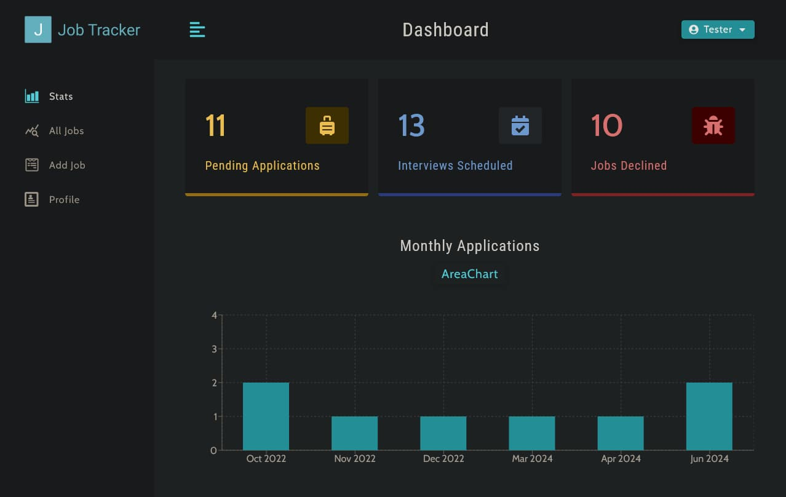
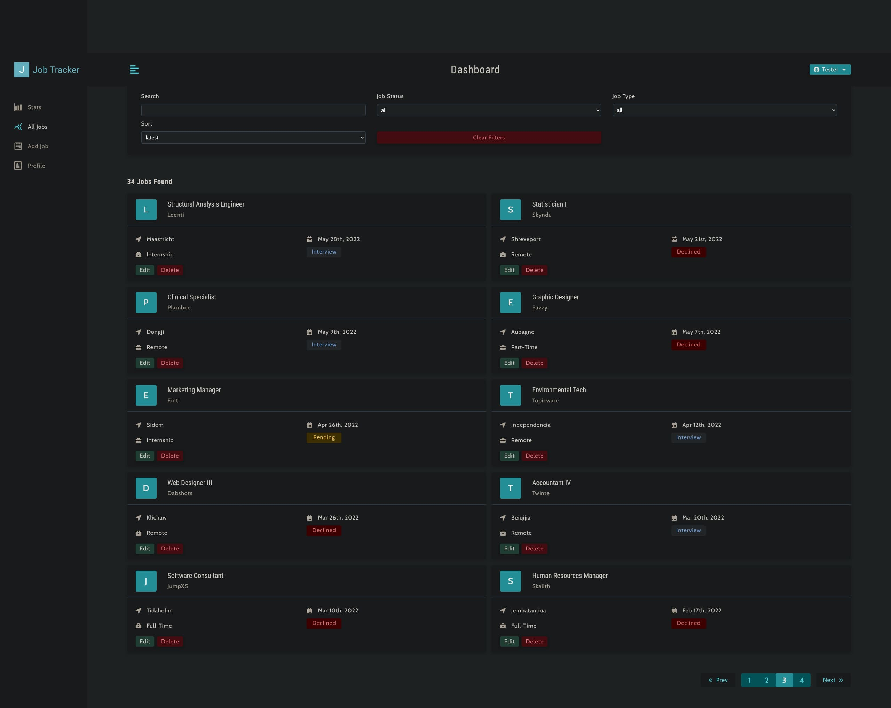
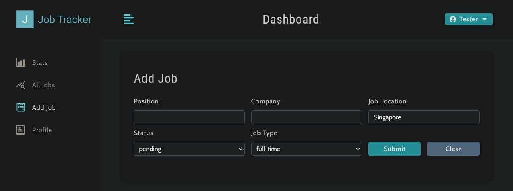
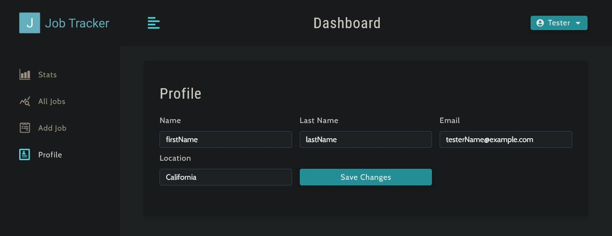

# job-tracker
 A job tracking and management application.

# Description

A full stack MERN application that helps the user track and manage their job applications.

# Live Demo

[Job Tracker - Live Demo](https://dragons-job-tracker.onrender.com)

You can log-in with a test account:

```js
email: test@test.com
pass:  test
```

# Preview & Screenshots

### 📊 Job Statistics Overview  
Monitor the status of your job applications. 


### 🔍 Browse & Search Jobs  
View your entire job list with search filters and pagination.


### ➕ Add New Jobs  
Submit job entries quickly using a simple input form.


### 👤 Profile Management  
Update your basic profile information.


# Technologies:
MongoDB, Express, React, Node.js

# Specifications

- User can view their pending applications and job statistics, together with an interchangeable chart.
- User can Register, Log-in, Log-out of the app securely with authentication
- Be able to search through their list of jobs added, with filter search options. Can quickly remove filters in one click.
- User can view and browse their list of jobs.
- Jobs have pagination so the user can browse all their jobs in manageable chunks and won't be overwhelmed.
- Add Job with position, company, location, status, and type as parameters
- Users can update their profile

# Instructions to run locally

- Note: You are going to need an existing [MongoDB Atlas account](https://www.mongodb.com/), to [Get a Connection String](https://www.mongodb.com/docs/guides/atlas/connection-string/).

**1. Clone this repo (or download zip on GitHub)**

**2. Go to the directory the files are located**

    In the terminal:

    ```powershell
    cd /job-tracker
    ```

**3. Install dependencies**

    In the terminal:

    ```powershell
    npm run install-dependencies
    ```

**4. Create an `.env` file**

Setup values for the following parameters:

- `MONGO_URL` - should be equal to your MongoDB connection string
- `SECRET_KEY` - any string that is secret to you. You can use this [Key Generator](https://www.allkeysgenerator.com/)
- `LIFETIME` - the lifetime of the JWT. This will determine a few things for the app such as for how long a user can stay logged in.
- `PORT` - is the port number you want the express server to listen to. 4000 by default.

Example of a `.env` file:

```js
MONGO_URL="Your_MongoDB_Connection_String"
SECRET_KEY="Secret_Key_You_Generated_Random_Characters"
LIFETIME="1d"
PORT=4000
```

**5. Run the app on localhost:3000**

In the terminal:
```powershell
npm run start
```

Now visit the URL: 

http://localhost:3000/